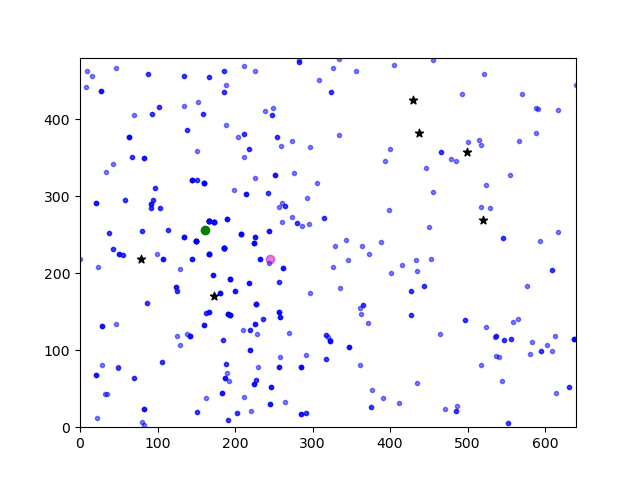

# Particle filter
## Example
 

## Usage
This repository contains implementation of landmark based particle filter localization. You can run script with:
```bash
python run.py [-h] [--width WIDTH] [--height HEIGHT] [--landmarks LANDMARKS] [--particles PARTICLES]
              [--std_position STD_POSITION] [--std_heading STD_HEADING] [--steps STEPS] 
```


